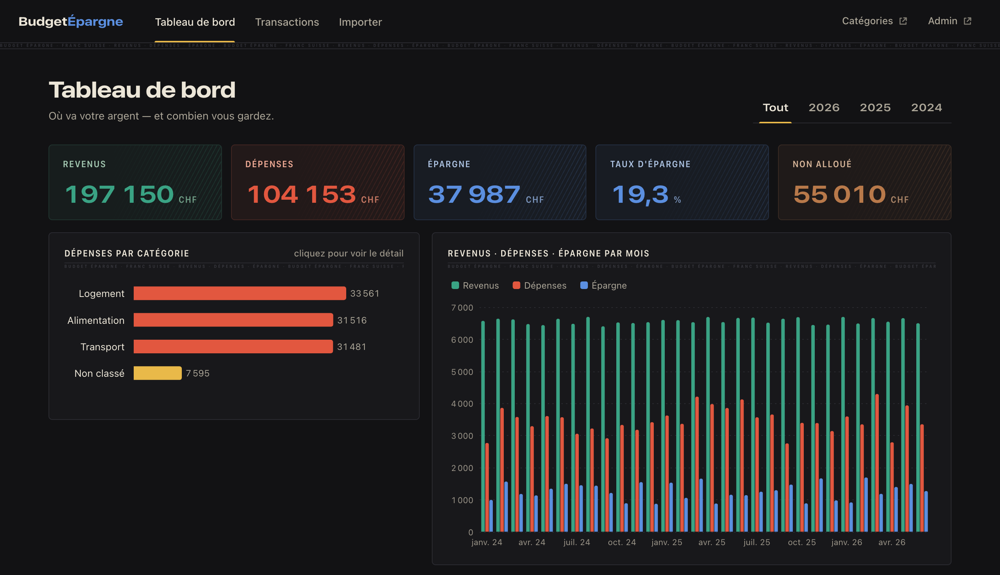
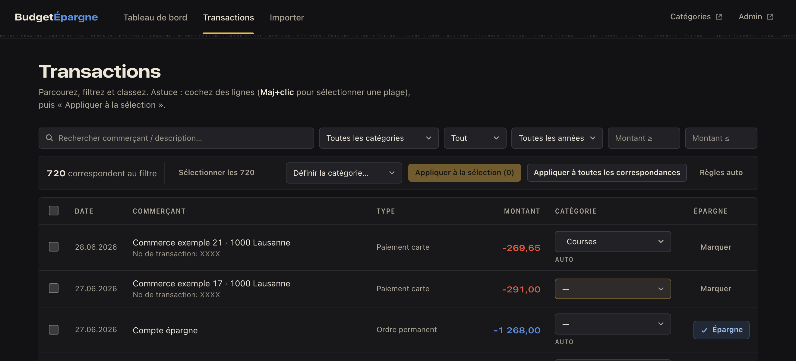
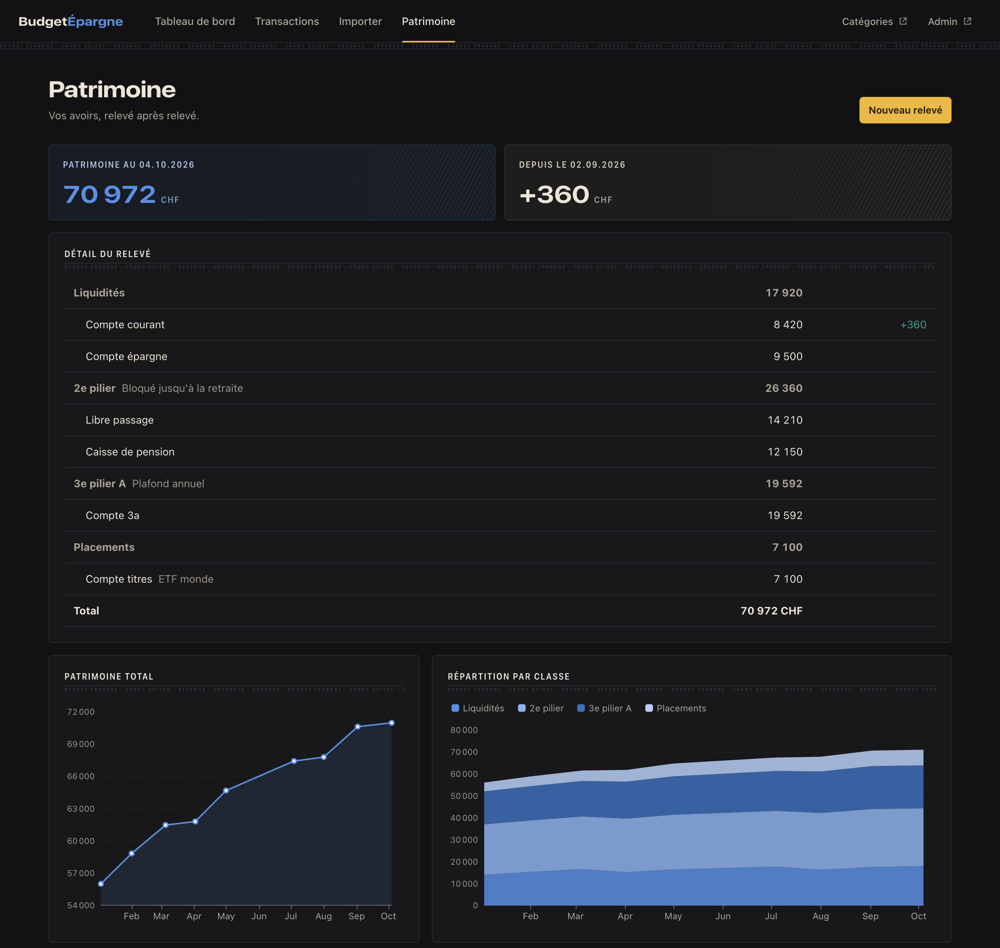

# Budget

A personal finance app with two parts:

- **Budget**: import bank and credit-card statements, sort every transaction into categories (by
  hand or with auto-match rules), and see where the money goes and how much of it is saved. Every
  figure and chart links back to the transactions behind it.
- **Patrimoine**: track total wealth over time (accounts, Swiss pension pillars, investments) from
  balances you enter yourself, about once a month.

The importer reads **UBS** CSV exports ([formats](#bank-exports-ubs)). To use another bank, add a
parser for its export and register it in `TransactionImporter::parserFor()`.



## How it's built

- **Stack:** [Statamic](https://statamic.com) (Solo) on Laravel, Livewire for the UI, MySQL, and
  Apache ECharts for charts. The UI is in French.
- **Code:** domain logic lives in `app/Services` (CSV parsers, importer, classifier, reports,
  Patrimoine), pages are Livewire components in `app/Livewire`, and views are in
  `resources/views`.
- **Data:** transactions and Patrimoine records are plain Eloquent tables. Categories are Statamic
  entries (a nested tree with auto-match terms), stored in the database via
  [`statamic/eloquent-driver`](https://github.com/statamic/eloquent-driver) and edited in the CP.
- **Access:** everything sits behind the Statamic control-panel login, with two-factor
  authentication required.
- **Docs:** [`CONTEXT.md`](CONTEXT.md) (vocabulary), [`PRODUCT.md`](PRODUCT.md),
  [`DESIGN.md`](DESIGN.md) and the decision records in [`docs/adr`](docs/adr).

## Setup

Requires PHP **8.5**, Composer and MySQL.

```bash
composer install
cp .env.example .env
php artisan key:generate
php artisan migrate
php artisan seed:budget      # starter categories with auto-match rules
php please make:user         # control-panel user (2FA is set up on first login)
php artisan serve
```

The app lives at `/budget`. You log in at `/cp`.

## Usage

### Budget

- **Import:** upload CSVs on the Import page (`/budget/import`), or drop them in
  `storage/app/imports/` and run `php artisan import:transactions`. Re-importing is safe because
  rows are de-duplicated.
- **Categories and rules:** manage them in the CP at `/cp/collections/categories`. Each category
  has a parent, a type (expense, income, savings or internal transfer) and _auto-match terms_.
  These are case-insensitive substrings matched against a transaction's merchant and description.
- **Classify:** filter and bulk-assign on `/budget/transactions`. To re-run the rules, use
  `php artisan classify:transactions`, which covers unclassified rows, or add `--all` to also cover
  rows already classified by a rule. Manual choices are never overwritten.



### Patrimoine

On `/budget/patrimoine`:

1. **Set up** your _Classes_ (groups such as "Liquidités" or "2e pilier") and your _Avoirs_ (each
   account or holding, in one Classe) in the "Gérer les avoirs" panel. An Avoir with a
   _versement mensuel_ (a standing order) also tracks the money paid into it.
2. **Enter a Relevé:** a dated snapshot of every Avoir's balance. The form is pre-filled from the
   previous Relevé, so you only change what moved. Versements are proposed as the monthly amount
   times the number of months since the previous Relevé. Amounts accept `12'283` and
   `12 283,50`. You can back-date a Relevé to enter your history; leave empty the Avoirs that did not
   exist yet.
3. **Read** the latest total and its change, the detail by Classe, the total over time, the split by
   Classe, and Versements vs. returns.

Closed Avoirs are archived from a date rather than deleted, so past totals never change.



## Bank exports (UBS)

The importer detects which of the two UBS exports a file is, so both can be dropped in together:

| | Account statement | Credit-card statement |
| --- | --- | --- |
| Parser | `app/Services/UbsCsvParser.php` | `app/Services/CreditCardCsvParser.php` |
| Encoding | UTF-8 with BOM | Windows-1252 (converted to UTF-8) |
| Start | account metadata block, data after the `Date de transaction` header row | `sep=;` hint, then the header row |
| Delimiter | `;` (quoted fields may contain `;`) | `;` |
| Dates | `YYYY-MM-DD` | `DD.MM.YYYY` (purchase date + booking date) |
| Amounts | signed `Débit` / `Crédit` columns, running `Solde` | unsigned CHF `Débit` / `Crédit`; foreign rows keep the original currency and rate in the raw row |
| Dedupe key | `No de transaction` | none in the export: a stable hash of the row (identical same-day rows are kept, numbered) |
| Skipped | lines without a transaction number | pending authorisations (no Débit/Crédit) and the footer totals |

Auto-match terms are compared against the merchant text (`Description1` / `Texte comptable`). Real
exports belong in `storage/app/imports/`, which git ignores.

## CI and deployment

`.github/workflows/deploy.yml` runs on every push to `master`, or by hand:

1. **Test:** `php artisan test` on PHP 8.5 against in-memory SQLite.
2. **Deploy:** runs only if the tests pass, and goes to shared hosting over SSH. It runs
   `composer install --no-dev` on the runner, then `artisan down`, an `rsync --delete` of the code,
   `migrate --force`, `optimize`, `please stache:refresh` and `artisan up`.

Deploys ship code and migrations only. They never overwrite `.env`, `users/` (the admin login) or
`storage/`, because production owns the data ([ADR 0001](docs/adr/0001-production-is-source-of-truth.md)).
Secrets, safeguards and recovery are covered in [docs/deployment.md](docs/deployment.md).

## Tests

```bash
php artisan test
```

The tests run on in-memory SQLite and use only synthetic data. Real figures never go into the
repository: not in fixtures, screenshots or docs.
